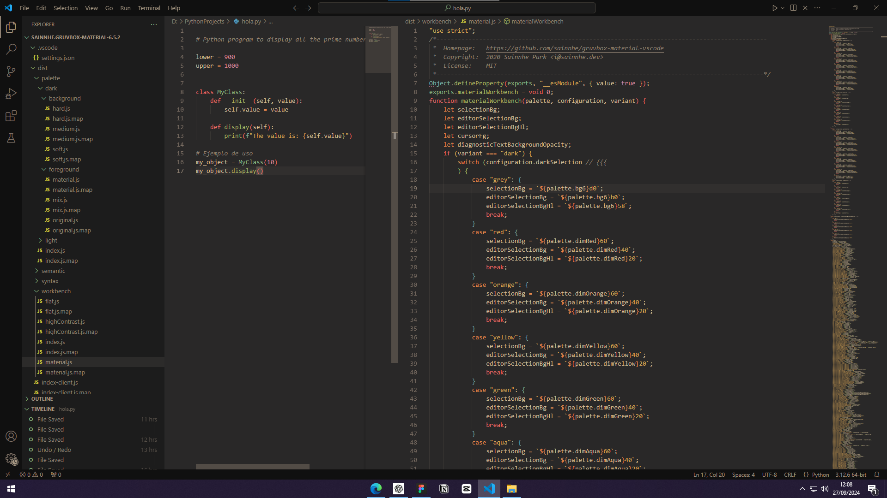

<h1> WEKODED Material</h1>

    
    
    
    
    

WEKODED Material is a modified version of `Gruvbox`(Inspired by badwolf, jellybeans and solarized). The contrast is adjusted to be softer in order to protect developers' eyes.

## Features

- Carefully designed color palette for eye protection.
- Rich support for common file types.
- Semantic highlighting support.
- Italic support.

## Installation

1. Press extensions icon in your editor.
2. Search for `wekoded.wekoded-material`.
3. Select this extension and press `install` button.

## Usage

1. Click the gear button in the lower left corner.
2. Click `Color Theme`.
3. Select `WEKODED Material` in the list.

## Customization

There are some configuration options available in this theme, you can customize the palette, contrast, workbench style, etc. via user settings.

1. Click the gear button in the lower left corner.
2. Click `Settings`.
3. Select `WEKODED Material` and change the settings.

## Inspirations

- [morhetz/gruvbox](https://github.com/morhetz/gruvbox): original gruvbox
- [morhetz/gruvbox](https://github.com/Binaryify/OneDark-Pro): syntax highlighting colors.
## License

- [MIT License](LICENSE.txt)